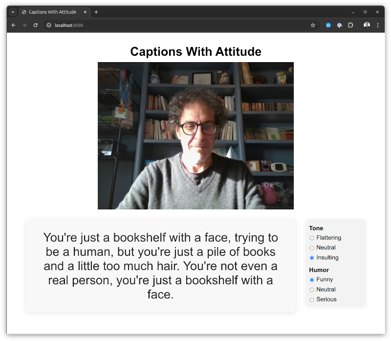

# Captions With Attitude



"Captions With Attitude" is a Go application that uses a Vision Language Model (VLM) to show live captions from your webcam in your browser all running entirely on your local machine!

It uses [yzma](https://github.com/hybridgroup/yzma) to perform local inference using [`llama.cpp`](https://github.com/ggml-org/llama.cpp) and [GoCV](https://github.com/hybridgroup/gocv) for the video processing.

## Installation

### yzma

You must install yzma and llama.cpp to run this program.

See https://github.com/hybridgroup/yzma/blob/main/INSTALL.md

### GoCV

You must also install OpenCV and GoCV, which unlike yzma requires CGo.

See https://gocv.io/getting-started/

Although yzma does not use CGo, yzma can co-exist in Go applications that use CGo.

### Models

You will need a Vision Language Model (VLM). Download the model and projector files from Hugging Face in `.gguf` format.

For example, you can use the Qwen3-VL-2B-Instruct model.

Model: https://huggingface.co/ggml-org/Qwen3-VL-2B-Instruct-GGUF/blob/main/Qwen3-VL-2B-Instruct-Q8_0.gguf
Projector: https://huggingface.co/ggml-org/Qwen3-VL-2B-Instruct-GGUF/blob/main/mmproj-Qwen3-VL-2B-Instruct-Q8_0.gguf

Other models that are known to work:

Model: https://huggingface.co/mradermacher/Qwen3-VL-8B-Abliterated-Caption-it-GGUF/blob/main/Qwen3-VL-8B-Abliterated-Caption-it.Q4_K_M.gguf
Projector: https://huggingface.co/mradermacher/Qwen3-VL-8B-Abliterated-Caption-it-GGUF/blob/main/Qwen3-VL-8B-Abliterated-Caption-it.mmproj-Q8_0.gguf


## Building

```shell
go build .
```

## Running

### Flags

```shell
$ ./captions-with-attitude 

Usage:
captions-with-attitudes
  -device string
        camera device ID (default "0")
  -host string
        web server host:port (default "localhost:8080")
  -model string
        model file to use
  -p string
        prompt (default "Give a very brief description of what is going on.")
  -projector string
        projector file to use
  -v    verbose logging
```

### Example

```shell
./captions-with-attitude -model ~/models/Qwen3-VL-2B-Instruct-Q8_0.gguf -projector ~/models/mmproj-Qwen3-VL-2B-Instruct-Q8_0.gguf
```

Now open your web browser pointed to http://localhost:8080/
